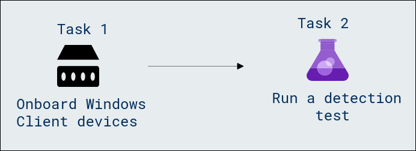
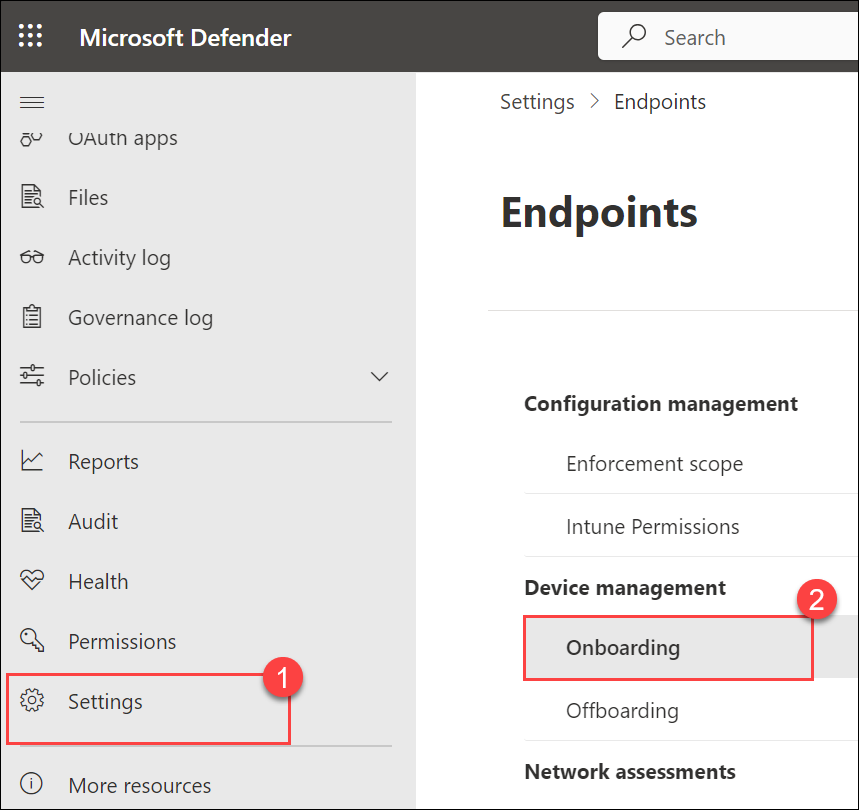
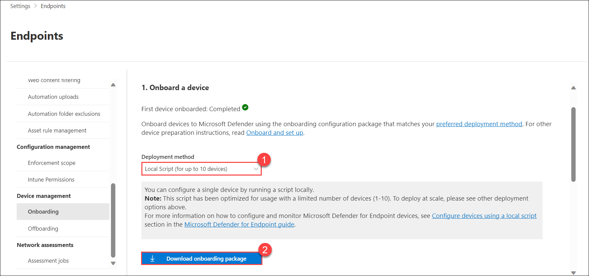
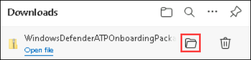
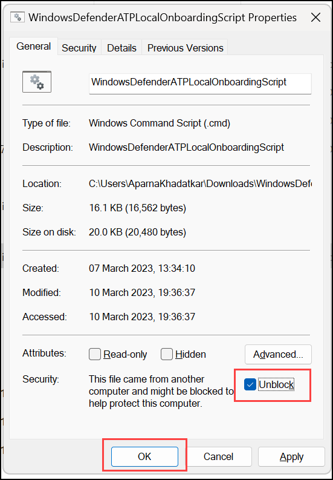
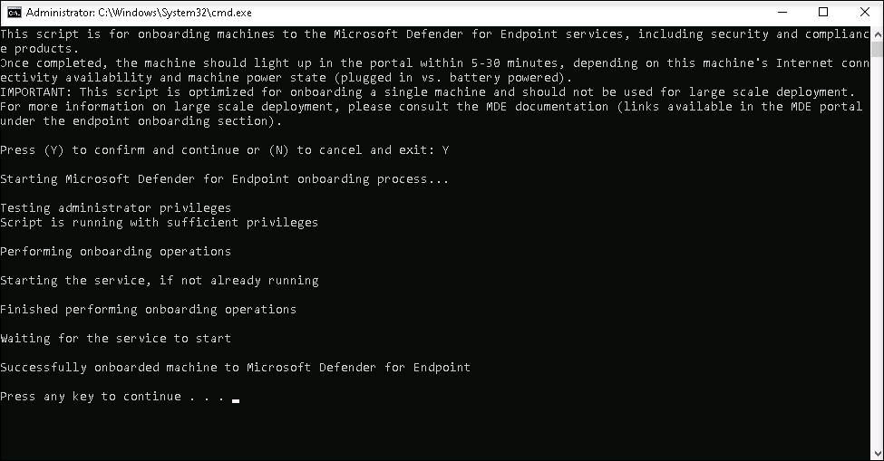
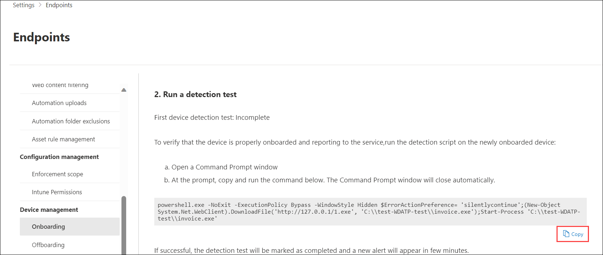
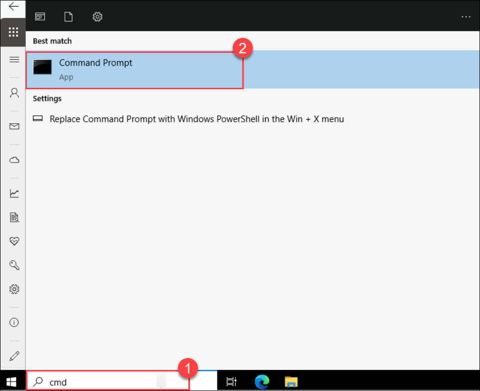

# Lab 02 - Onboard Machines

## Lab overview

Microsoft Defender for Endpoint and running detection tests to assess the responsiveness of the security service. Participants will actively engage in setting up and configuring Defender for Endpoint, understanding how to seamlessly integrate devices and evaluate their effectiveness in threat detection scenarios.

## Lab scenario

The objective of this lab is to provide participants with hands-on experience in onboarding machines to Microsoft Defender for Endpoint. It involves the process of integrating and configuring them to seamlessly connect with a security or management system. This typically includes installing necessary software, configuring settings, and ensuring compliance with security policies. In the context of Microsoft Defender for Endpoint, onboarding Windows client devices involves downloading and installing the Defender for Endpoint client, confirming successful onboarding, and configuring security policies to enhance threat protection on the Windows devices.

- **Onboard Windows Client devices**

    - Initiate Onboarding: Participants will initiate the onboarding process from the Microsoft Defender portal, downloading and executing the onboarding script.
    - Verify Onboarding Success: Emphasis will be placed on verifying the successful onboarding of Windows client devices and troubleshooting any potential issues.
    - Understand Onboarding Best Practices: Participants will learn best practices for effective onboarding, ensuring that devices are properly configured and compliant.

- **Run a Detection Test**

    - Execute Detection Test Script: Participants will run a detection test script on the newly onboarded devices using PowerShell.
    - Verify Defender for Endpoint Responsiveness: The script execution will verify that devices properly report to the Defender for Endpoint service, ensuring its responsiveness.
    - Real-world Significance: Participants will understand the real-world significance of detection tests, assessing the system's ability to detect and respond to potential threats.

## Lab objectives

In this lab, you will perform the following:

- Task 1: Onboard Windows Client devices 
- Task 2: Run a detection test

## Architecture Diagram

  

### Task 1: Onboard Windows Client devices

In this task, you will onboard windows client devices to Microsoft Defender for Endpoint using an onboarding script.

1. If you are not already at the Microsoft Defender portal in your browser, start the Microsoft Edge browser go to (https://security.microsoft.com) and log in with the **Tenant Email** credentials.

1. Select **Settings (1)** from the left menu bar, then from the Settings page, select **Endpoints**.

1. Select **Onboarding (2)** under Device Management section.

    >**Note:** You can also perform device onboarding from the **Assets** section of the left menu bar. Expand Assets and select Devices. On the Device Inventory page, with Computers & Mobile selected, scroll down to **Onboard devices.** This takes you to the **Settings > Endpoints** page.

    

1. In the "**1. Onboard a device**" area make sure "**Local Script (for up to 10 devices) (1)**" is displayed in the Deployment method drop-down and select the **Download onboarding package (2)** button. 

    

1. Under the *Downloads* pop-up, highlight the "WindowsDefenderATPOnboardingPackage.zip" file with your mouse and select the folder icon **Show in folder**. **Hint:** In case you don't see it, the file should be in the c:\users\admin\downloads directory.

    

1. Right-click the downloaded zip file and select **Extract All...**, make sure that **Show extracted files when complete** is checked and select **Extract**.

1. Right-click on the extracted file "WindowsDefenderATPLocalOnboardingScript.cmd" and select **Properties**. Select the **Unblock** checkbox in the bottom right of the Properties windows and select **OK**.

    

1. Right-click on the extracted file **WindowsDefenderATPLocalOnboardingScript.cmd** again and choose **Run as Administrator**.  

    >**Hint:** If you encounter the Windows SmartScreen window, select on **More info**, and choose **Run anyway**. 

    >**Note:**  When the "User Account Control" window is shown, select **Yes** to allow the script to run.
    
1. Type **Y** to the question presented by the script and press **Enter**. When complete you should see a message in the command screen that says *Successfully onboarded machine to Microsoft Defender for Endpoint*.

1. Press any key to continue. This will close the Command Prompt window.

    

### Task 2: Run a detection test

In this task, run the following PowerShell script on a newly onboarded device to verify that it's properly reporting to the Defender for Endpoint service.

1. Back in the Onboarding page from the Microsoft Defender portal, under the section "**2. Run a detection test**", copy the detection test script by selecting the **Copy** button.  

    

1. Inside the Lab-VM, on the **Type here to search**, and search for **CMD (1)**, right-click on **Command Prompt (2)** and select **Run as administrator**.

    

1. Paste the script by right-clicking in the **Administrator: Command Prompt** windows and press **Enter** to run it. 

    >**Note:** The window closes automatically after running the script.

1. Open the Microsoft Defender portal. In the left-hand menu, under the **Assets** area, select **Devices (1)**. You can see the device that is onboarded. If the device is not shown, complete the previous task and come back to check it later. It can take up to 60 minutes for the first device to be displayed in the portal.

     .png)

    >**Note:** If you have completed the onboarding process and don't see devices in the Devices list after an hour, it might indicate an onboarding or connectivity problem.

    > **Congratulations** on completing the task! Now, it's time to validate it. Here are the steps:
   > - Navigate to the Lab Validation Page, from the upper right corner in the lab guide section.
   > - Hit the Validate button for the corresponding task. If you receive a success message, you can proceed to the next task. 
   > - If not, carefully read the error message and retry the step, following the instructions in the lab guide.
   > - If you need any assistance, please contact us at labs-support@spektrasystems.com. We are available 24/7 to help you out.

## Review
In this lab, you have completed the following:

- Onboarded Windows Client devices 
- Ran a detection test

## You have successfully completed the lab. Click on Next >>.
