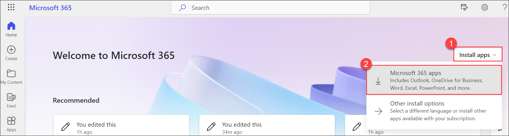
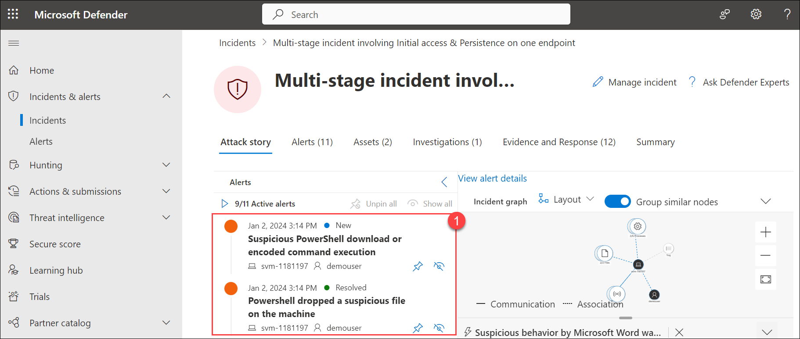
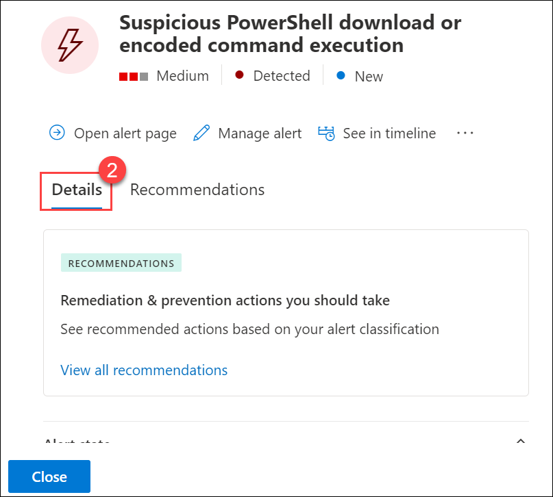
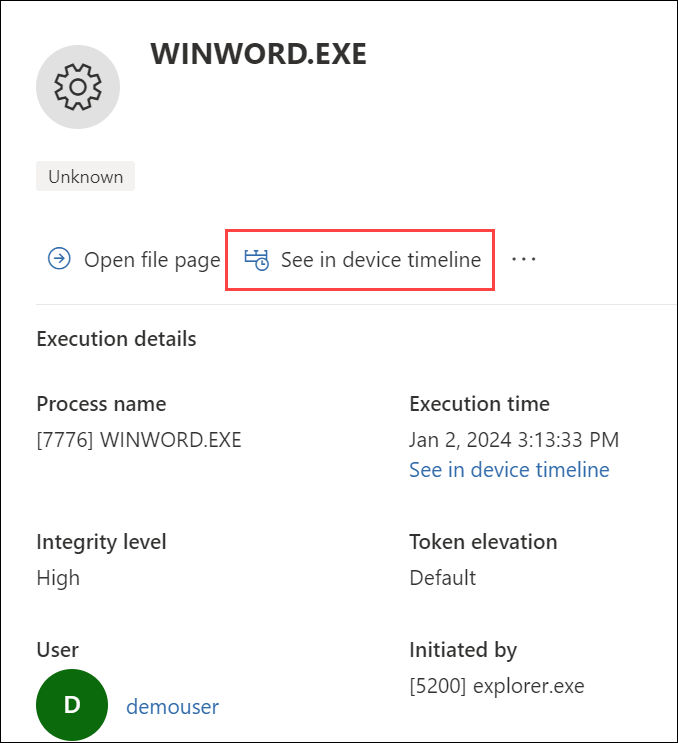

# Lab 03 - End to end EDR (Incident, Alerts, Actions & Live Responses)

## Lab overview

This lab encompasses the end-to-end process of incident detection, alert generation, response actions, and live responses within an EDR framework. Participants will gain hands-on experience in managing security incidents from detection to resolution, utilizing the live response feature for real-time remediation.

## Lab scenario

Creating Incidents in Microsoft 365 Defender involves identifying potential security threats from various alerts and promptly responding to mitigate risks. Security analysts investigate these alerts to confirm their severity and impact.

- **Incident Detection**: Participants will learn how EDR systems detect security incidents by monitoring endpoint activities and behaviors.
Understanding the criteria for identifying potential incidents is a key focus.

- **Alert Generation**: The lab emphasizes the automatic generation of alerts based on detected incidents. Participants will explore how EDR platforms categorize and prioritize alerts for efficient incident response.

- **Response Actions**: Practical response actions to mitigate the impact of incidents will be explored.
Participants will learn to leverage EDR capabilities to respond to incidents effectively.

- **Live Responses**: The lab introduces participants to the concept of live responses for real-time remediation.
Practical scenarios will be simulated where participants actively respond to ongoing security incidents.

## Lab objectives

In this lab, you will perform the following:

- Task 1: Create Incident and alerts
- Task 2: Actions & Live Responses

## Architecture Diagram

### Task 1: Create Incident and alerts

In this task, you will run two simulated attacks to explore the capabilities of Microsoft Defender for Endpoint.

1. Open a new browser tab, go to the (https://www.office.com), in the **Sign in** dialog box, copy and paste * Email/Username: <inject key="AzureAdUserEmail"></inject> and then select Next. In the **Enter password** dialog box, copy and paste * Password: <inject key="AzureAdUserPassword"></inject> and then select **Sign in**.

1. You will be redirected to the home page of Microsoft 365. Select **Install apps (1)**, and choose **Microsoft 365 apps (2)** to download all the Microsoft 365 apps to the desktop.

    

1. After downloading, select **Open file** to initiate the installation process. Once the installation is complete, close the installation pop-up.

1. If the Microsoft 365 Defender portal is not open in your Microsoft Edge browser, open a new tab and go to (https://security.microsoft.com).

1. In the **Sign in** dialog box, copy and paste * Email/Username: <inject key="AzureAdUserEmail"></inject> and then select Next.

1. In the **Enter password** dialog box, copy and paste * Password: <inject key="AzureAdUserPassword"></inject> and then select **Sign in**.

1. From the menu, under **Endpoints**, select **Evaluation & tutorials (1)** and then select **Tutorials & simulations (2)** from the left side.

   

1. Select the **Tutorials (1)** tab.

1. Under *Automated investigation (backdoor)* you will see a message describing the scenario. Below this paragraph, click **Read the walkthrough (3)**. A new browser tab opens which includes instructions to perform the simulation.

   

1. In the new browser tab, locate the section named **Run the simulation** (page 5, starting at step 2) and follow the steps to run the attack. **Hint:** The simulation file *RS4_WinATP-Intro-Invoice.docm* can be found back in portal, just below the **Read the walkthrough** you selected in the previous step by selecting the **Get simulation file** button. 

1. After downloading the file,  right-click on the file, open the file with **Microsoft Word** and enter the password as `WDATP!diy#`.

1. If it asks you for the Sign in, click on **Sign in** copy and paste in the Username and password provided in the environment details page, and select next.    

1. Click **Enable Editing** if the document opens inProtectedView. If you see a subsequent security warning about macros being disabled.    

1. To unblock the document, navigate to its location in File Explorer. In File Explorer, right-click the document, and select Properties. In the General tab, mark the Unblock option under Security.   

1. Close the **Microsoft Word** and re-open from the File Explorer and enter the password as `WDATP!diy#` after re-opening click on **Enable Content** and click on **OK**. 

1. In the Command prompt pop-up press any key to close. 
      
    >**Note:** **Congrats – you’re done running the attack!** The attack simulation ends here. A real attacker, if successful, would likely continue to scan for information, send collected reconnaissance information to a command-and-control (C&C) server, and use this information to move laterally and pursue other attractive targets. Next, let’s review and investigate the Defender for Endpoint alerts that surfaced in the simulated attack.

    >**Note:** Incidents & Alerts should start to appear 15-30 minutes after the simulated backdoor is launched.

1. In the Microsoft 365 Defender portal select **Incidents & alerts** from the left menu bar, then select **Incidents**.

    

1. A new incident called "Multi-stage incident involving Initial access & Persistence on one endpoint" is in the right pane. Click the incident name to load its details.

    

    

1. From the left menu bar, choose **Incidents & Alerts (1)**, then click on **Alerts (2)** to view all generated alerts. You can select any of the alerts to check the details.

    

### Task 2: Actions & Live Responses

1. In the Microsoft 365 Defender portal select **Incidents & alerts** from the left menu bar, then select **Incidents**.

    

1. Select **Multi-stage incident involving Initial access & Persistence on one endpoint**, on the **Multi-stage incident involving Initial access & Persistence on one endpoint (1)** page, select any one of the active alerts, on the alerts page under **Details (2)** section, view each and every details present inside the details section.

    

    

1. After viewing, choose **Manage alerts**. On the **Manage alert** page, follow these instructions: select **Save**, and then close the alert page.
    
    |**Settings**|**Value**|
    |------------|---------|
    |Status|**Resolved**|
    |Assign to|**Assign to me**|
    |Classification|**Select as per your choice**|
    |Comment (Optional)|**Add a comment** as per your choice|

1. Now, you will be on the incident page for **Multi-stage incident involving Initial access & Persistence on one endpoint**. Select the **Evidence and Responses (1)** tab; here, you can see all the listed evidence. Choose each piece of evidence to check the corresponding responses.

    

1. If you select any of the pieces of evidence, on the evidence page, choose **See in device timeline** to view the detailed report of the evidence.

    

## Review
In this lab, you have completed the following:

- Created Incident and alerts
- Explored Actions & Live Responses

## You have successfully completed the lab.
