# Lab 03 - End to end EDR (Incident, Alerts, Actions & Live Responses)

## Lab overview

This lab encompasses the end-to-end process of incident detection, alert generation, response actions, and live responses within an EDR framework. Participants will gain hands-on experience in managing security incidents from detection to resolution, utilizing the live response feature for real-time remediation.

## Lab scenario

Creating Incidents in Microsoft 365 Defender involves identifying potential security threats from various alerts and promptly responding to mitigate risks. Security analysts investigate these alerts to confirm their severity and impact.

- **Incident Detection:** Participants will learn how EDR systems detect security incidents by monitoring endpoint activities and behaviors.
Understanding the criteria for identifying potential incidents is a key focus.

- **Alert Generation:** The lab emphasizes the automatic generation of alerts based on detected incidents. Participants will explore how EDR platforms categorize and prioritize alerts for efficient incident response.

- **Response Actions:** Practical response actions to mitigate the impact of incidents will be explored.
Participants will learn to leverage EDR capabilities to respond to incidents effectively.

- **Live Responses:** The lab introduces participants to the concept of live responses for real-time remediation.
Practical scenarios will be simulated where participants actively respond to ongoing security incidents.

## Lab objectives

In this lab, you will perform the following:

- Task 1: Create Incident and alerts
- Task 2: Investigate Incidents & Alerts (Actions)
- Task 3: Live Responses

## Architecture Diagram

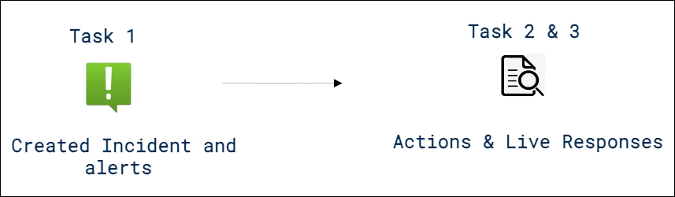

### Task 1: Create Incident and alerts

In this task, you will run two simulated attacks to explore the capabilities of Microsoft Defender for Endpoint.

1. Open a new tab, and browse to the [Microsoft 365](https://www.office.com). 

    >**Note:** If it shows you the **Sign in** dialog box, copy and paste * Email/Username: <inject key="AzureAdUserEmail"></inject> and then select Next. In the **Enter password** dialog box, copy and paste * Password: <inject key="AzureAdUserPassword"></inject> and then select **Sign in**.

    >**Note:** On the **Welcome to Microsoft 365** select **>**. Select **>** on **As an administrator, you have additional tools to manage your company**, and select **✔** on **Next, we'll show you some tips to help you personalize and organize Microsoft 365 your way**. Close all the pop-ups.

1. You will be redirected to the home page of Microsoft 365. Select **Install and more (1)**, and choose **Install Microsoft 365 apps (2)** to download all the Microsoft 365 apps to the desktop.

    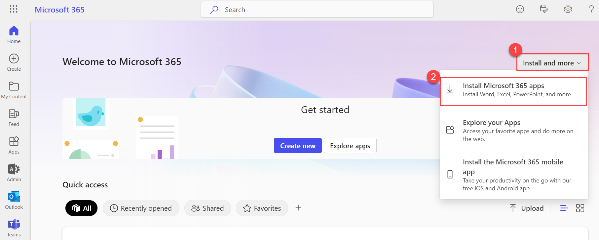

1. On the **My account** page, under **Office apps & devices** select **Install office**.

1. After downloading, select **Open file** to initiate the installation process. Once the installation is complete, close the installation pop-up.

1. If the Microsoft 365 Defender portal is not open in your Microsoft Edge browser, open a new tab and go to (https://security.microsoft.com).

1. In the **Sign in** dialog box, copy and paste * Email/Username: <inject key="AzureAdUserEmail"></inject> and then select Next.

1. In the **Enter password** dialog box, copy and paste * Password: <inject key="AzureAdUserPassword"></inject> and then select **Sign in**.

1. From the menu, under **Endpoints**, select **Evaluation & tutorials (1)** and then select **Tutorials & simulations (2)** from the left side.

   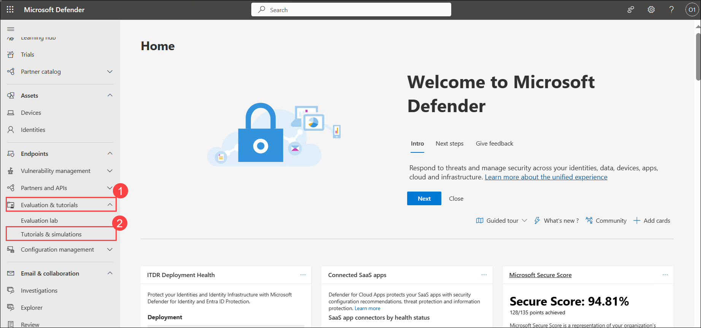

1. Select the **Tutorials (1)** tab.

1. Under *Automated investigation (backdoor)* you will see a message describing the scenario. Below this paragraph, click **Read the walkthrough (2)**. A new browser tab opens which includes instructions to perform the simulation.

   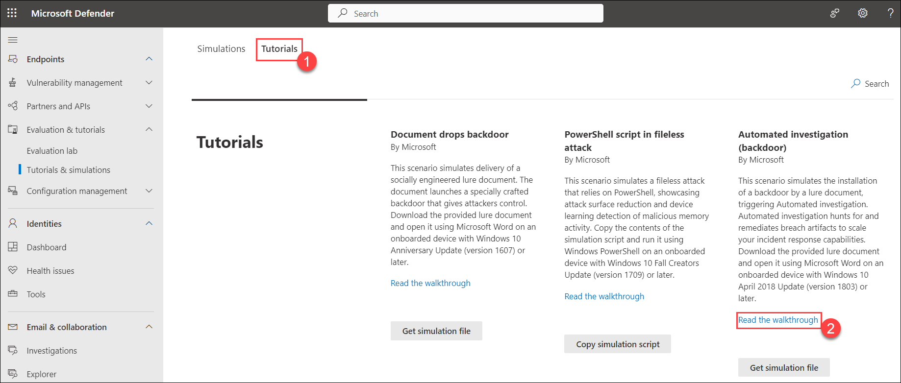

1. In the new browser tab, locate the section named **Run the simulation** (page 5, starting at step 2) and follow the steps to run the attack. 

    > **Hint:** The simulation file *RS4_WinATP-Intro-Invoice.docm* can be found back in the Microsoft Defender portal, just below the **Read the walkthrough** you selected in the previous step by selecting the **Get simulation file** button. 

1. After downloading the file, select **Open file**. It will open with **Microsoft Word** and enter the password as `WDATP!diy#`.

1. Select **Continue** to activate the word.

1. On the **Activate office** pop-up, copy and paste the Username and password provided in the environment details page, and select **Next**. 

1. On the **Stay signed in to all your apps**, select **No, sign in to this app only**.

    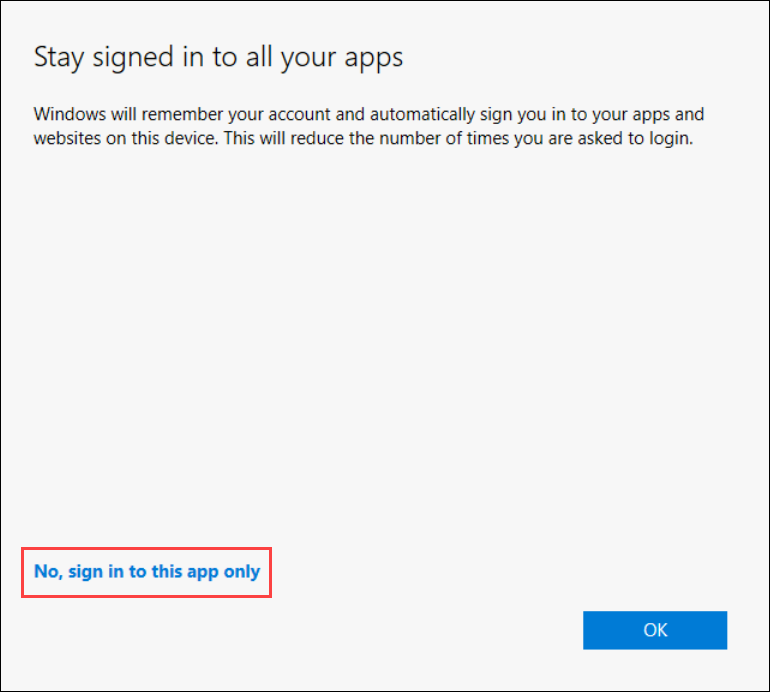

1. Select **Accept** on the **Accept the license agreement** page, and close the privacy matters page.

1. Click **Enable Editing** if the document opens inProtectedView. If you see a subsequent security warning about macros being disabled. Close the Word file. 

1. To unblock the document, navigate to its location in File Explorer. In File Explorer, right-click the document, and select Properties. In the General tab, check the **Unblock (1)** option under Security, and select **OK (2)**.   

    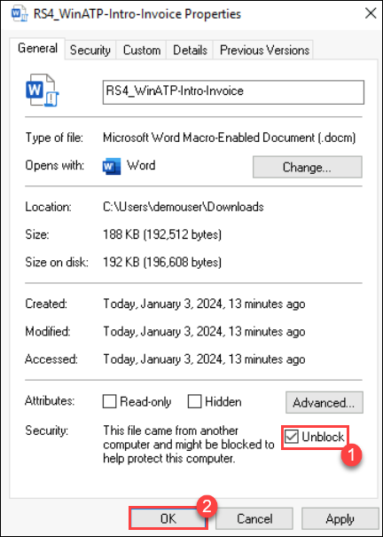

1. Re-open the word file from the File Explorer and enter the password as `WDATP!diy#` after re-opening click on **Enable Content** and click on **OK**. 

1. In the Command prompt pop-up press any key to close. 
      
    >**Note:** **Congrats – you’re done running the attack!** The attack simulation ends here. A real attacker, if successful, would likely continue to scan for information, send collected reconnaissance information to a command-and-control (C&C) server, and use this information to move laterally and pursue other attractive targets. Next, let’s review and investigate the Defender for Endpoint alerts that surfaced in the simulated attack.

    >**Note:** Incidents and alerts should start to appear 15-30 minutes after the simulated backdoor is launched.

1. Open the Microsoft 365 Defender portal select **Incidents & alerts** from the left menu bar, then select **Incidents**.

    

1. Select the new incident named "**Multi-stage incident involving Initial access & Persistence on one endpoint**" to load its details.

    

    >**Note:** If you are unable to see the incident, please wait for 15-30 minutes; it will appear.

    >**Note:** Select **Close** on the **Multi-stage incident involving Initial access & Persistence on one endpoint**.

1. From the left menu bar, choose **Incidents & Alerts (1)**, then click on **Alerts (2)** to view all generated alerts. You can select any of the alerts to check the details.

    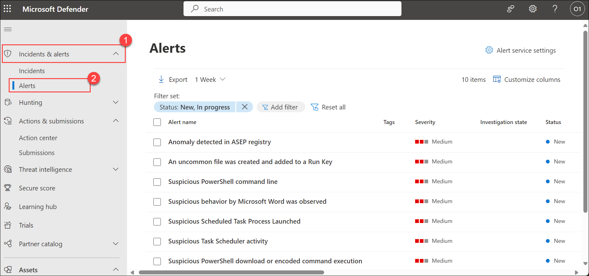

    > **Congratulations** on completing the task! Now, it's time to validate it. Here are the steps:
   > - Navigate to the Lab Validation Page, from the upper right corner in the lab guide section.
   > - Hit the Validate button for the corresponding task. If you receive a success message, you can proceed to the next task. 
   > - If not, carefully read the error message and retry the step, following the instructions in the lab guide.
   > - If you need any assistance, please contact us at labs-support@spektrasystems.com. We are available 24/7 to help you out.

### Task 2: Investigate Incidents & Alerts (Actions)

When you investigate an incident, you'll see:

- Incident details
- Incident comments and actions
- Tabs (attack story, alerts, assets, investigations, evidence & response, summary)

1. Navigate back to the **Incidents** page, by selecting **Incidents**, under **Incidents & alerts**.

1. Select the new incident named "**Multi-stage incident involving Initial access & Persistence on one endpoint**" to load its details. This opens the main page for the incident where you'll find the full attack story information and tabs for alerts, devices, users, investigations, and evidence. 

     

    >**Note:** Select **Close** on the **Multi-stage incident involving Initial access & Persistence on one endpoint**.

1. Here are the detailed information on the tabs:

    - **Attack story**:- 

    - Attack stories help you to quickly review, investigate, and remediate attacks while viewing the full story of the attack on the same tab. It also allows you to review the entity details and take remediation actions, such as deleting a file or isolating a device without losing context. Within the attack story you can find the alert page and the incident graph. The incident alert page has these sections:- Alert story, which includes: What happened, Actions taken, Related events, and Alert properties in the right pane (state, details, description, and others).
    
        >**Note:** Note that not every alert will have all of the listed subsections in the Alert story section.

        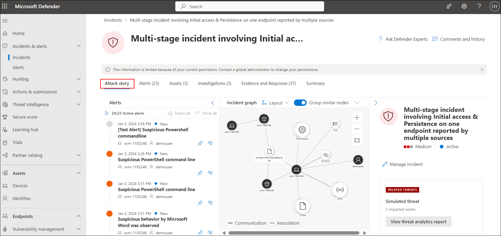

    - **Alert**:- 

    - On the Alerts tab, you can view the alert queue for alerts related to the incident and other information about them such as:

        - Severity.
        - The entities that were involved in the alert.
        - The source of the alerts (Microsoft Defender for Identity, Microsoft Defender for Endpoint, Microsoft Defender for Office 365, Defender for Cloud Apps, and the app governance add-on).
        - The reason they were linked together.

            

        - For example, By default, the alerts are ordered chronologically to allow you to see how the attack played out over time. When you select an alert within an incident, Microsoft Defender displays the alert information specific to the context of the overall incident.
            - You can see the events of the alert, which other triggered alerts caused the current alert, and all the affected entities and activities involved in the attack, including devices, files, users, and mailboxes.

                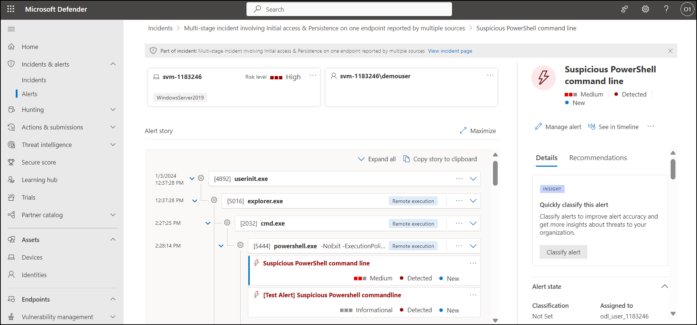

    - **Assets**:- 

    - Easily view and manage all your assets in one place with the new **Assets** tab. This unified view includes Devices, Users, Mailboxes and Apps.

    - The Assets tab displays the total number of assets beside its name. A list of different categories with the number of assets within that category is presented when selecting the Assets tab.

        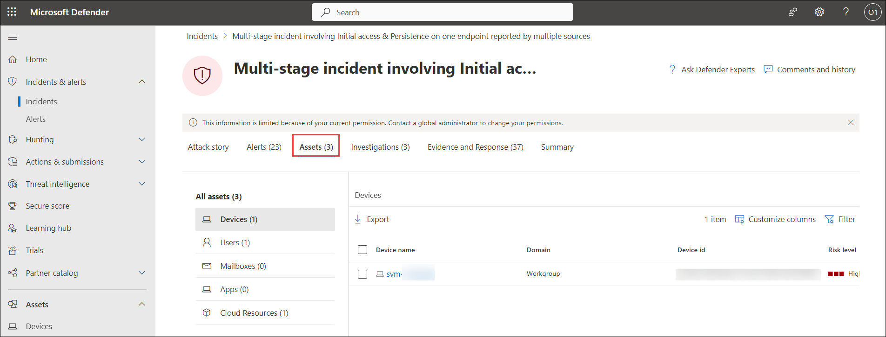

        - **Devices**:- 

            - The **Devices** view lists all the devices related to the incident. Here's an example.
                
                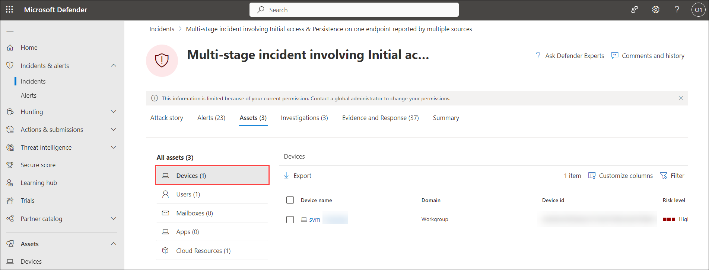
            
                - Selecting a device from the list opens a bar that allows you to manage the selected device. You can quickly export, manage tags, initiate automated investigations, and more.

                - Select the name of the device to see device details in the Defender for Endpoint device inventory. From the device page, you can gather additional information about the device, such as all of its alerts, a timeline, and security recommendations. For example, from the Timeline tab, you can scroll through the device timeline and view all events and behaviors observed on the machine in chronological order, interspersed with the alerts raised. Here's an example

                    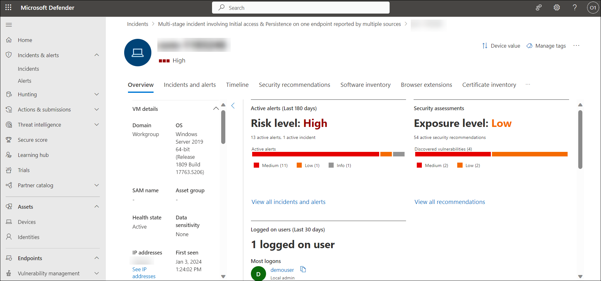

        >**Note:** Go back to the **Assets** tab page.
        
        - **Users**:- 
            
        - The Users view lists all the users that have been identified to be part of or related to the incident. Here's an example.

            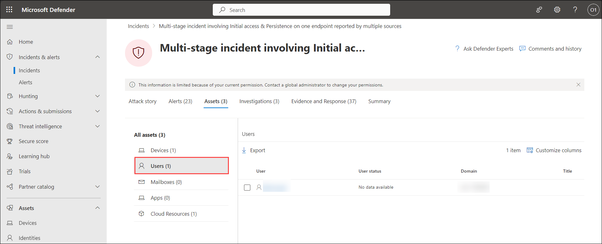

        - You can select the check mark for a user to see details of the user account threat, exposure, and contact information. Select the user name to see additional user account details.

    - **Mailboxes**:- 

        - The Mailboxes view lists all the mailboxes that have been identified to be part of or related to the incident.

    - **Apps**:- 

        - The Apps view lists all the apps identified to be part of or related to the incident. Here's an example.

    - **Investigations**:- 

    - The **Investigations** tab lists all the automated investigations triggered by alerts in this incident. Automated investigations will perform remediation actions or wait for analyst approval of actions, depending on how you configured your automated investigations to run in Defender for Endpoint and Defender for Office 365.

        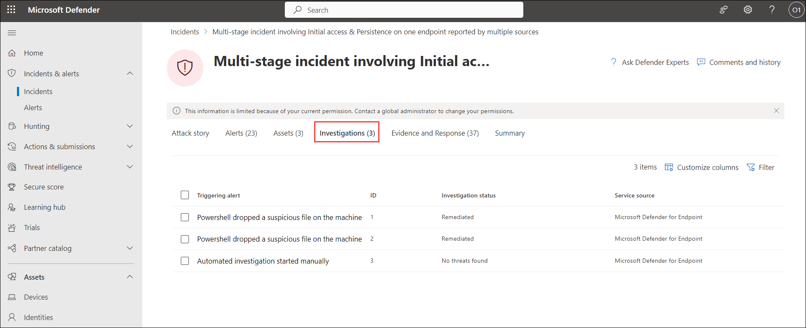

    - Select an investigation to navigate to its details page for full information on the investigation and remediation status.

    - There is also an Investigation graph tab that shows:

        - The connection of alerts to the impacted assets in your organization.
        - Which entities are related to which alerts and how they are part of the story of the attack?
        - The alerts for the incident.

    - The investigation graph helps you quickly understand the full scope of the attack by connecting the different suspicious entities that are part of the attack with their related assets such as users, devices, and mailboxes.

        >**Note:** Go back to the **Investigations** tab, page.

    - **Evidence and Response**:- 

    - The Evidence and Response tab shows all the supported events and suspicious entities in the alerts in the incident. Here's an example.

        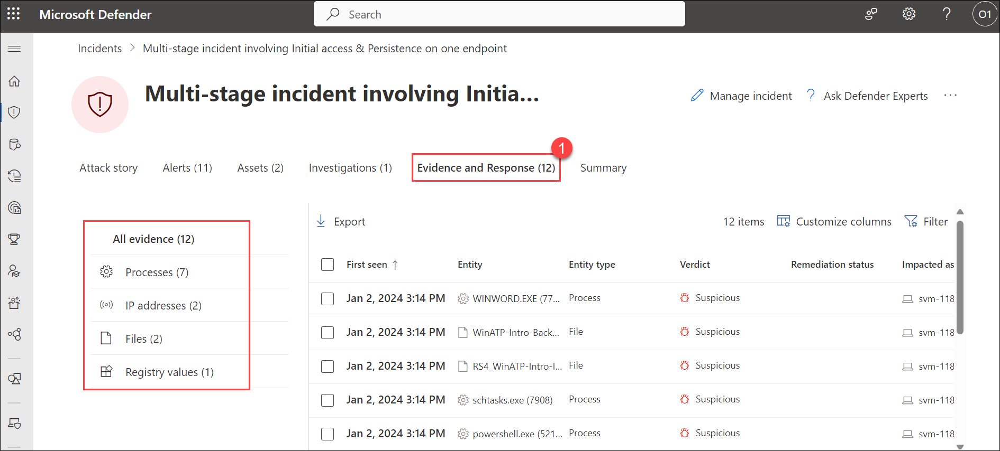

    - Microsoft Defender automatically investigates all the incidents' supported events and suspicious entities in the alerts, providing you with information about important emails, files, processes, services, IP Addresses, and more. This helps you quickly detect and block potential threats in the incident.

    - Each of the analyzed entities is marked with a verdict (Malicious, Suspicious, Clean) and a remediation status. This helps you understand the remediation status of the entire incident and what next steps can be taken.

1. To continue the investigation, select the **Alerts** tab, and select any one alert. It will open detailed information about the alert.               

    

1. On the alert page, under **Alert story** select any item in the process tree to open the side pane, it contains details like execution and file details including the hash, size and signer. Scroll down to the side pane to understand the number of times this file has been seen worldwide and in the organization. 

1. Select **Open file page**, to drill into it and continue with the investigation. The file page provides incredible details about an executable file. 

    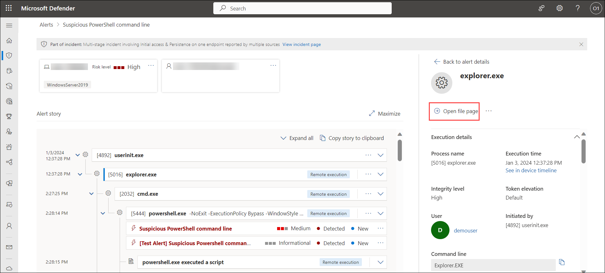

1. - The **Overview (1)** tab provides the same information as the file side pane did. 

    - The **Incidents & alerts (2)** tab goes on to show all the alerts associated with this file. 

    - The **Observed in Organization (3)** tab provides even more context. It lists the machine this file has been observed on, and you can even use the interactive timeline to scope it to a date range within the past six months. 

    - Last, if you're unsure whether the file is malicious, send it for **Deep analysis (4)**. Select **Submit**, it will submit the file to Microsoft Defender for Endpoint for detonation and observation, with detailed results provided in a report.

        >**Note:** If the file is malicious, select **Stop and Quarantine File**, it will display the pop-up of the **Stop and Quarantine File**, provide a comment and select **Confirm**.

1. Once, you are satisfied that you have dealt with the incident addressed the alerts linked to it and taken all required remediation actions, the step is to resolve it. To do that, select **Manage incident**

1. Navigate back to the **Incident** page, on the **Attack story** tab, select the alert which you were investigating, and select **Manage alert**.

    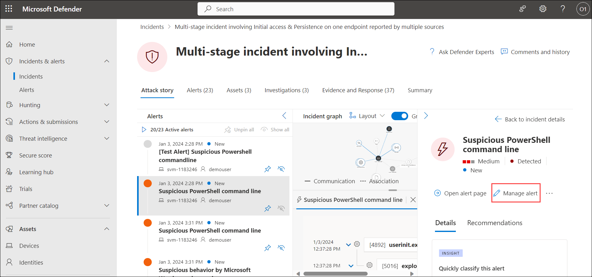

1. On the **Manage alert** page, follow these instructions: select **Save**, and then close the alert page.
    
    |**Settings**|**Value**|
    |------------|---------|
    |Status|**Resolved**|
    |Assign to|**Assign to me**|
    |Classification|**Select according to your preference**|
    |Comment (Optional)|**Add a comment** as per your choice|

### Task 3: Live Responses

In this task, Live response is crafted to bolster investigations, empowering your security operations team to gather forensic data, execute scripts, forward suspicious entities for analysis, mitigate threats, and actively pursue emerging threats.

1. If you are not on the **Microsoft Defender** portal, open a new tab and go to (https://security.microsoft.com).

1. On the **Microsoft Defender** portal, from the left-navigation menu select **Settings (1)**, on the **Settings** page, select **Endpoints (2)**. 

    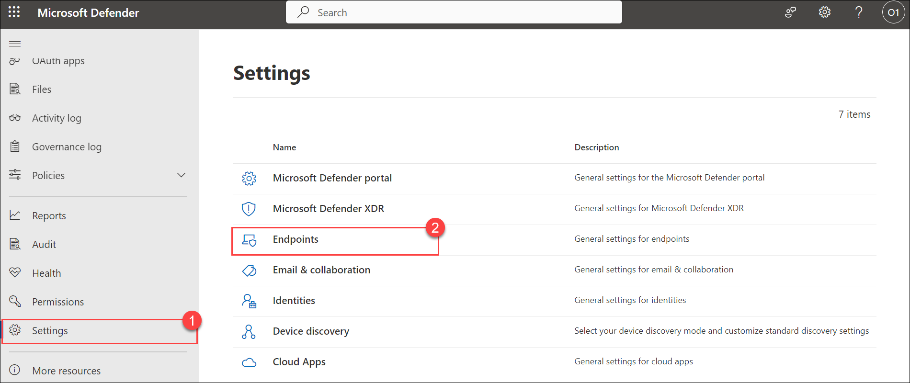

1. Now, we will enable the **Live Response**, so that we can, run basic and advanced commands to do investigative work on a device. Download files such as malware samples and outcomes of PowerShell scripts. Download files in the background (new!).
Upload a PowerShell script or executable to the library and run it on a device from a tenant level.
Take or undo remediation actions.

1. On the **Endpoints** page, select **Advanced features (1)**, scroll down until you found the **Live Response** toggle. Now, follow these instructions, and choose **Save preferences (4)**:

    |**Settings**|**Value**|
    |------------|---------|
    |Live Response| **On (2)**|
    |Live Response for Servers|**On (3)**|

    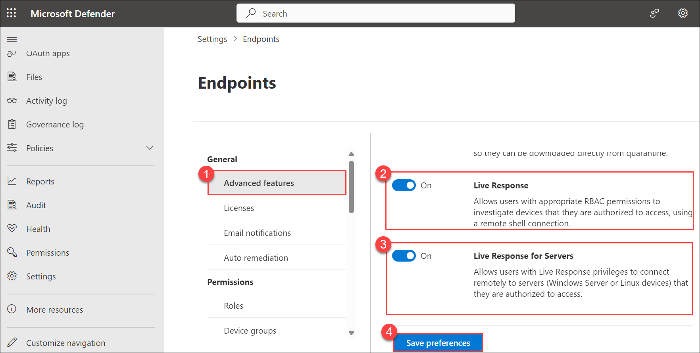

1. From the left navigation menu, under **Assets**, select **Devices (1)**, and select the device (2) that you are using to generate the alerts and the incidents.

    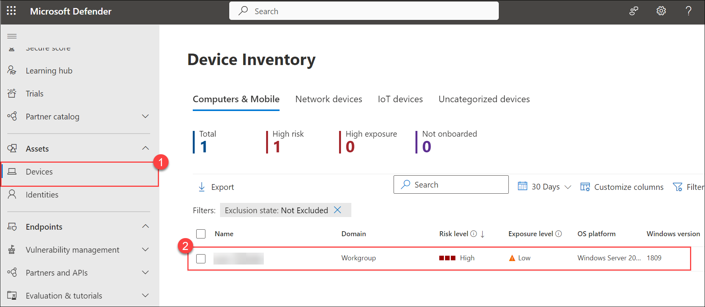

1. On the **Device** page, select **More actions (...) (1)**, and select **Initiate Live Response Session (2)**.

    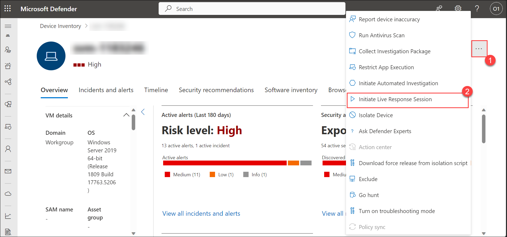

1. When you initiate a live response session on a device, a dashboard opens. The dashboard provides information about the session such as the following:

    - Who created the session
    - When the session started
    - The duration of the session

        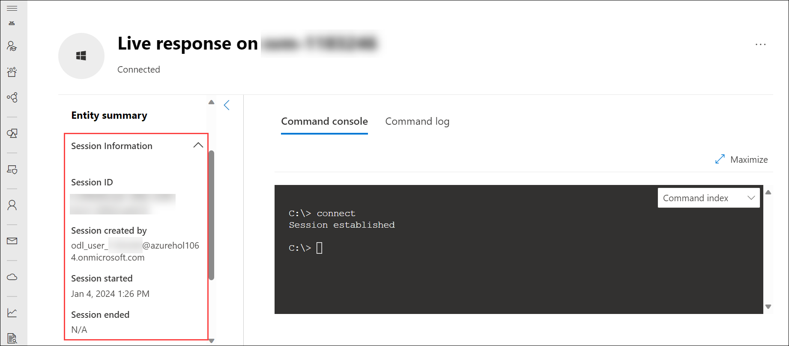

1. Now run the following commands:

    ```PowerShell
    connect
    ```

    >**Note:** **Connect**:- It initiates a live response session to the device.

    ```PowerShell
    connections
    ```

    >**Note:** **Connections**:- Shows all the active connections.

    ```PowerShell
    processes
    ```

    >**Note:** **Processes**:- Shows all processes running on the device.

    ```PowerShell
    scheduledtasks
    ```

    >**Note:** **scheduledtasks**:- Shows all scheduled tasks on the device.

    ```PowerShell
    services
    ```

    >**Note:** **Services**:- Shows all services on the device.

    >**Note:** If you have any malware script or diagnostic script that you want to run and check using Live Response, you can do so by following these steps:

    1. On the top of the page select **Upload file to library**.

        

    2. Select **Upload file to library (1)**, selecṭ the **Malware script**, and any **Diagnostic script** **(2)** to upload. Select **Submit**.

        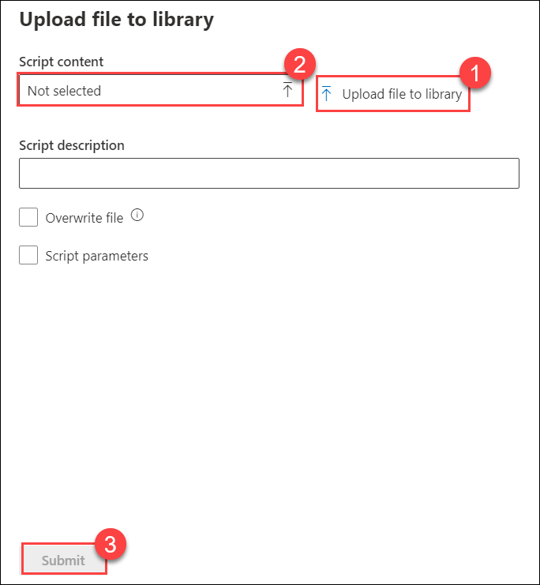

    3. After uploading the script, run the following commands:

        ```PowerShell
        library
        ```

        ```PowerShell
        Run <Filename>
        ```

1. View the console help to learn about command parameters. To learn about an individual command, run:

    ```PowerShell
    help <command name>
    ```

    >**Note:** Replace **commandname** with the command for which you need help. 

1. Select the **Command log** tab to see the commands used on the device during a session. Each command is tracked with full details such as:

    - ID
    - Command line
    - Duration
    - Status and input or output side bar 

    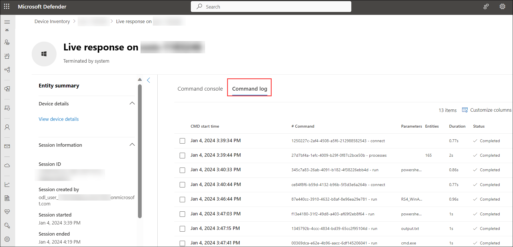

## Review
In this lab, you have completed the following:

- Created Incidents and alerts
- Investigated Incidents & Alerts
- Explored the Live Responses

## You have successfully completed the lab. Click on Next >>.
