# Lab 04 - Vulnerability Management and Mitigation

## Lab overview

This lab focuses on utilizing a Vulnerability Management Dashboard to gain an overview of system vulnerabilities and implementing security recommendations to mitigate potential risks. Participants will actively engage in identifying, prioritizing, and addressing vulnerabilities to enhance the overall security posture.

## Lab scenario

- **Overview of Vulnerability Management Dashboard**: Participants will gain familiarity with the Vulnerability Management Dashboard.
Understanding how to navigate and interpret the dashboard for effective vulnerability assessment is a key focus.

- **Security Recommendations**: The lab guides participants in accessing and utilizing security recommendations within the Vulnerability Management Dashboard. Participants will learn how to prioritize and implement recommended security measures to address identified vulnerabilities.

## Lab objectives

In this lab, you will perform the following:

- Task 1: Overview of Vulnerability Management dashboard
- Task 2: Security recommendations
- Task 3: Security baselines assessment

## Architecture Diagram

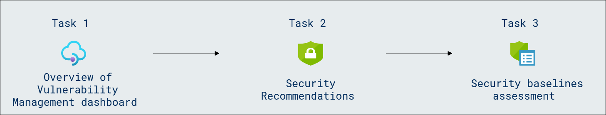

### Task 1: Overview of Vulnerability Management dashboard

In this task, you can leverage the Defender Vulnerability Management dashboard in the Microsoft Defender portal to:

- View your exposure score and Microsoft Secure Score for Devices, along with top security recommendations, software vulnerability, remediation activities, and exposed devices.
- Correlate EDR insights with endpoint vulnerabilities and process them.
- Select remediation options to triage and track the remediation tasks.
- Select exception options and track active exceptions.

    >**Note:** Devices that are not active in the last 30 days are not factored in on the data that reflects your organization's vulnerability management exposure score and Microsoft Secure Score for Devices.

1. If you are not already at the Microsoft 365 Defender portal, in your Microsoft Edge browser, go to (https://security.microsoft.com). 

1. In the **Sign in** dialog box, copy and paste * Email/Username: <inject key="AzureAdUserEmail"></inject> and then select Next.

1. In the **Enter password** dialog box, copy and paste * Password: <inject key="AzureAdUserPassword"></inject> and then select **Sign in**.

1. From the left navigation menu, under **Endpoints**, select **Vulnerability management (1)** drop-down, then select **Dashboard (2)**. 

    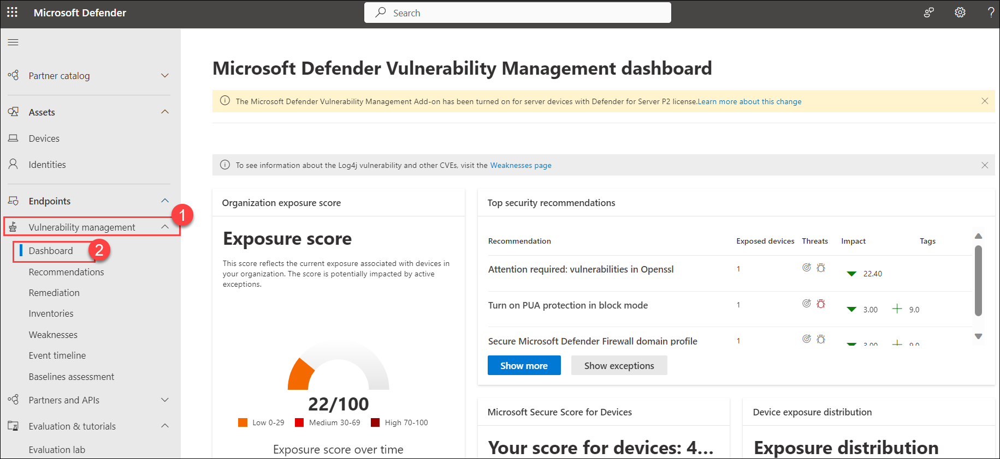

1. Here is the overview of the Vulnerability Management dashboard,

   |Area|Descriptions|
   |----|------------|
   |**Filter by device groups (#/#)**|Filter the vulnerability management data you want to see in the dashboard and cards by device groups. What you select in the filter applies throughout the vulnerability management pages.|
   |**Exposure score**|See the current state of your organization's device exposure to threats and vulnerabilities. Several factors affect your organization's exposure score: weaknesses discovered in your devices, likelihood of your devices to be breached, value of the devices to your organization, and relevant alerts discovered with your devices. The goal is to lower the exposure score of your organization to be more secure. To reduce the score, you need to remediate the related security configuration issues listed in the security recommendations.|
   |**Microsoft Secure Score for Devices**|See the security posture of the operating system, applications, network, accounts, and security controls of your organization. The goal is to remediate the related security configuration issues to increase your score for devices. Selecting the bars will take you to the Security recommendation page.|
   |**Device exposure distribution**|See how many devices are exposed based on their exposure level. Select a section in the doughnut chart to go to the Devices list page and view the affected device names, exposure level, risk level, and other details such as domain, operating system platform, its health state, when it was last seen, and its tags.|
   |**Expiring certificates**|See how many certificates have expired or are due to expire in the next 30, 60 or 90 days.|
   |**Top security recommendations**|See the collated security recommendations that are sorted and prioritized based on your organization's risk exposure and the urgency that it requires. Select Show more to see the rest of the security recommendations in the list. Select Show exceptions for the list of recommendations that have an exception.|
   |**Top vulnerable software**|Get real-time visibility into your organization's software inventory with a stack-ranked list of vulnerable software installed on your network's devices and how they impact your organizational exposure score. Select an item for details or Show more to see the rest of the vulnerable software list in the Software inventory page.|
   |**Top remediation activities**|Track the remediation activities generated from the security recommendations. You can select each item on the list to see the details in the Remediation page or select Show more to view the rest of the remediation activities, and active exceptions.|
   |**Top exposed devices**|View exposed device names and their exposure level. Select a device name from the list to go to the device page where you can view the alerts, risks, incidents, security recommendations, installed software, and discovered vulnerabilities associated with the exposed devices. Select Show more to see the rest of the exposed devices list. From the devices list, you can manage tags, initiate automated investigations, initiate a live response session, collect an investigation package, run antivirus scan, restrict app execution, and isolate device.|

### Task 2: Security recommendations

In this task, you are required to provide a comprehensive overview of various aspects related to security recommendations. View recommendations, the number of weaknesses found, related components, threat insights, number of exposed devices, status, remediation type, remediation activities, impact to your exposure score and Secure Score for Devices once the recommendation is implemented, and associated tags.

The color of the Exposed devices graph changes as the trend changes. If the number of exposed devices is on the rise, the color changes to red. If there's a decrease in the number of exposed devices, the color of the graph will change to green.

>**Note:** Vulnerability management shows devices that were in use up to 30 days ago. This is different from the rest of Microsoft Defender for Endpoint, where if a device has not been in use for more than 7 days it has in an 'Inactive' status.

1. From the left navigation menu, under **Endpoints**, select **Vulnerability management (1)** drop-down, choose **Recommendations (2)**, this page contains a list of security recommendations for the threats and vulnerabilities found in the organization.

    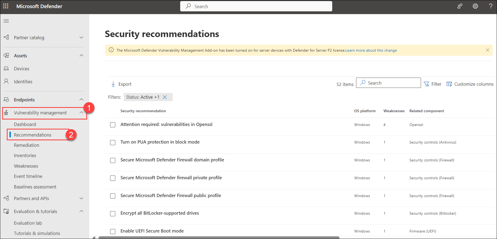

    - Useful icons also quickly call your attention to:

        - : **possible active alerts**
        - : **associated public exploits**
        - : **recommendation insights**

    - The impact column shows the potential impact on your exposure score and Secure Score for Devices once a recommendation is implemented. You should prioritize items that will lower your exposure score and raise your Secure Score for Devices.

    - The potential reduction in your exposure score is displayed as **(1)** . A lower exposure score means devices are less vulnerable to exploitation. Since the exposure score is based on a combination of factors, including new remediations or newly discovered vulnerabilities, the actual score reduction may be lower.

    - The projected increase to your Secure Score for Devices is displayed as **(2)**. A higher Secure Score for Devices means your endpoints are more resilient against cybersecurity attacks.

        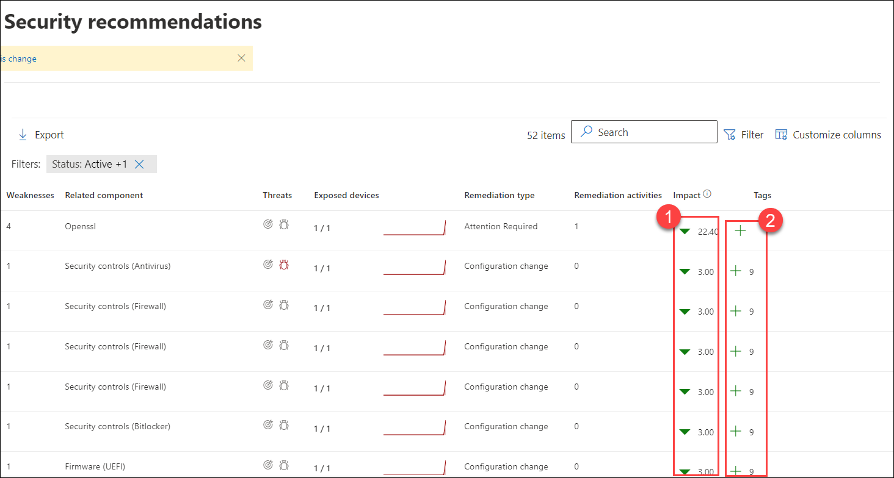

1. On the **Security recommendations** page, select any recommendation of your choice, You can also select all recommendations at once, but for now, choose any one of them.

    >**Note:** Wait for 15-20 minutes, to show all the recommendations.

1. It will open the remediation side pane, From the flyout, there are following options:

    - **Open software page** - Open the software page to get more context on the software and how it's distributed. The information can include threat context, associated recommendations, weaknesses discovered, number of exposed devices, discovered vulnerabilities, names and detailed of devices with the software installed, and version distribution.

    - **Remediation options** - Submit a remediation request to open a ticket in Microsoft Intune for your IT administrator to pick up and address. Track the remediation activity in the Remediation page.

    - **Exception options** - Submit an exception, provide justification, and set exception duration if you can't remediate the issue yet.

    - **Request remediation** - The vulnerability management remediation capability bridges the gap between Security and IT administrators through the remediation request workflow. Security admins like you can request for the IT Administrator to remediate a vulnerability from the Security recommendation page to Intune.

    > **Note**: When a software change is made on a device, it typically takes 2 hours for the data to be reflected in the security portal. However, it may sometimes take longer. Configuration changes can take anywhere from 4 to 24 hours.

1. It will open a new pane of the recommendation, on the remediation page, select **Request remediation**.

    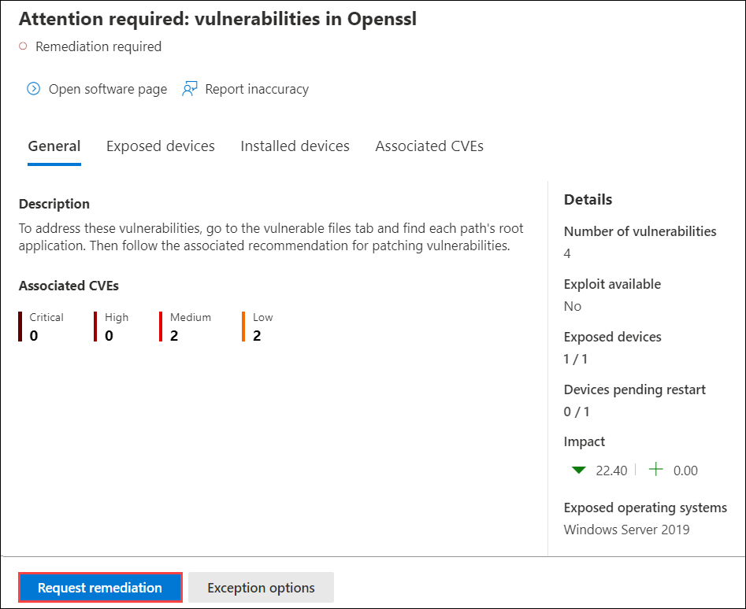

    >**Note:** The vulnerability management remediation capability bridges the gap between Security and IT administrators through the remediation request workflow. 

1. It will open a **Request remediation** form. On the **Remediation request** page, you can edit or select the **Remediation options** and **Priority** as per your choice, once done select **Next**.

    >**Note:** If it asks you for the **Remediation due date**, enter the due date.

1. On the **Review and Finish** page, if you want to export the data as CSV file, you can select the checkbox, and select **Submit**. Select **Done**, on the **Remediation activities created** page.

    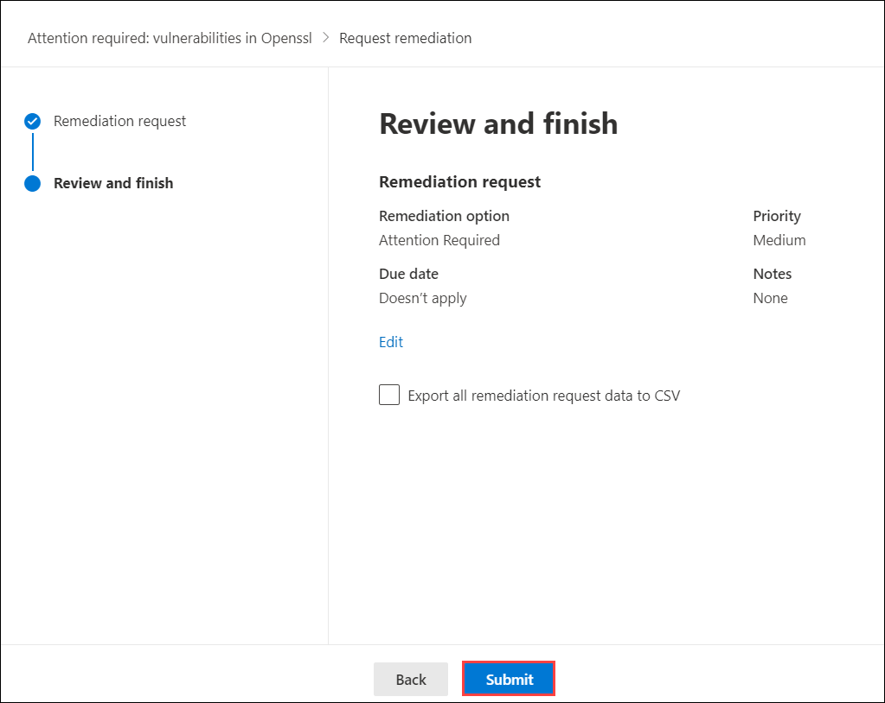
 
1. Now, close the **Attention required: vulnerabilities in Openssl** page.

1. Now, from the left navigation, select **Remediation (1)**, under **Activities (2)**, you can view the status of your **remediation request (3)**.

    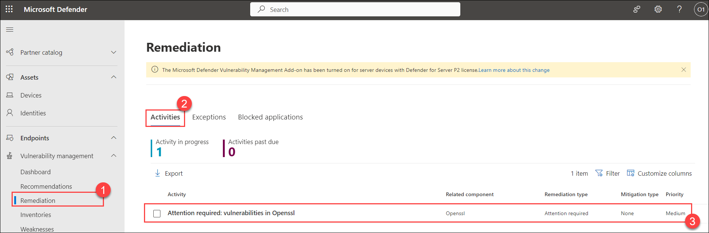

1. After, requesting the remediation it can take 24 hours or more then 24 hours, to show the results.

1. When you submit a remediation request from the Security recommendations page, it kicks off a remediation activity. A security task is created that can be tracked. There will be no progress bar, ticket status, or due date since there's no actual action we can monitor.

1. Once you are in the **Remediation** page, select the remediation activity that you want to view. You can follow the remediation steps, track progress, view the related recommendation, **Export to CSV (1)**, or **mark as complete (2)**.

    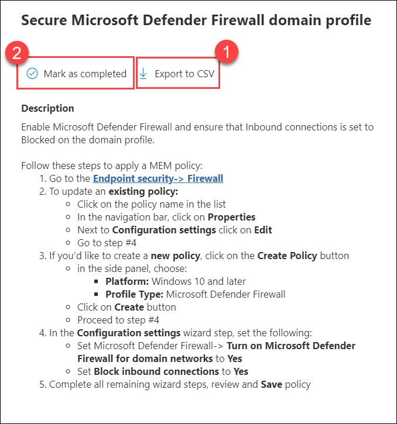

1. You can track who closed the remediation activity with the "**Completed by**" column on the Remediation page.

    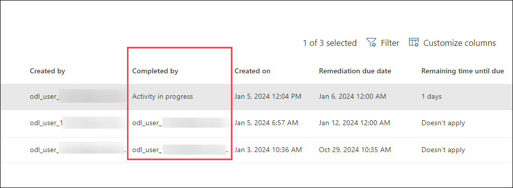

1. As an alternative to a remediation request when a recommendation is not relevant at the moment, you can create **exceptions** for recommendations. Only users with "**exceptions handling**" permissions can add exception.

1. When an exception is created for a recommendation, the recommendation is no longer active. The recommendation state will change to **Full exception** or **Partial exception** (by device group).

### Task 3: Security baselines assessment

Instead of running never-ending compliance scans, security baselines assessment helps you to continuously and effortlessly monitor your organization's security baselines compliance and identify changes in real time.

1. From the left navigation menu, under **Endpoints**, select **Vulnerability management (1)** drop-down, choose **Baselines assessment (2)**. On the **Security baselines assessment** page, select **Profiles (3)** tab.

    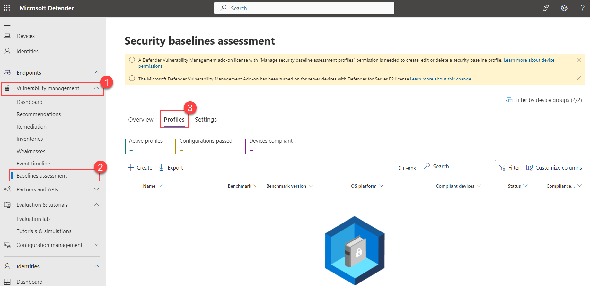

1. Select **+ Create** button.

1. Enter a **Name** and **Description** for your security baselines profile and select **Next**.

1. On the **Baseline profile scope** page set the profile settings as follows, and select **Next**:-

    |Settings|Value|
    |-------|------|
    |Software|Microsoft Windows Server 2019|
    |Benchmark| Select any one from the CIS or STIG|
    |Compliance level|Select one of your choice|

1. On the **Add configuration settings** page, select the configurations you want to include in the profile.

1. Select **Next**. On the **Devices to assess** page, under **Device Groups** select **All device groups**.

1. Select **Next** to review the profile.

1. Select **Submit** to create your profile.

1. On the final page, select **View profile page** to see the assessment results.

    >**Note:** You can create multiple profiles for the same operating system with various customizations.

1. In the **Profiles** page, select the profile that you created to open a flyout with additional information. 

    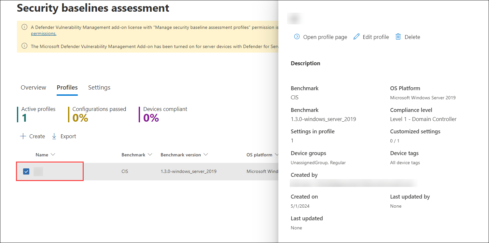

1. Select **Open profile page**. The profile page contains two tabs **Configurations** and **Devices**.

    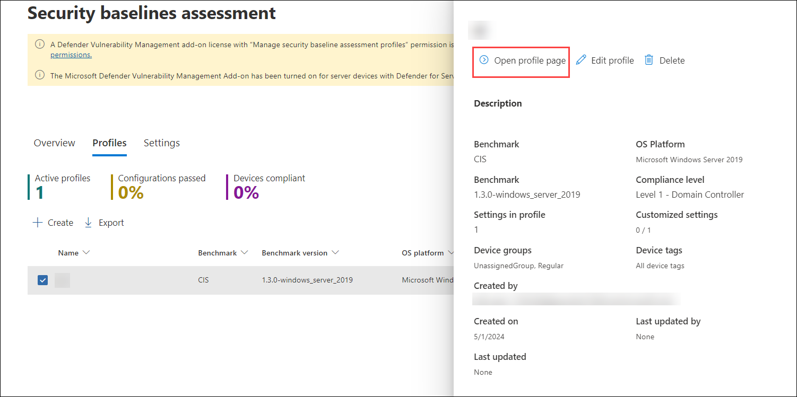

1. In the **Configurations** tab, you can review the list of configurations and assess their reported compliance state.     

    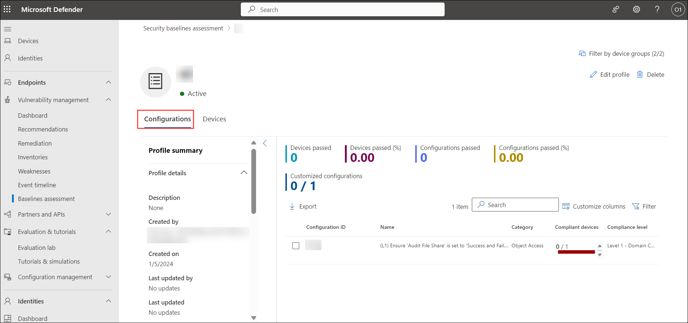

1. By selecting a **configuration** in the list, you'll see a flyout with details for the policy setting, including the recommended value (the expected value range for a device to be considered compliant) and the source used to determine the current device settings.

    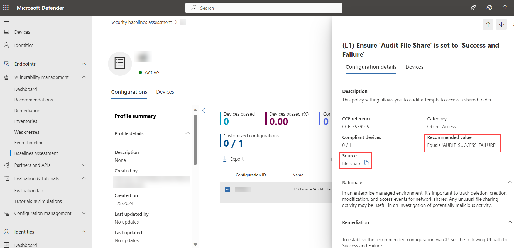

1. Now, select **Devices** tab, it shows a list of all applicable devices and their compliance state against this specific configuration. For each device, you can use the current value detected to see why it's compliant or non compliant.

    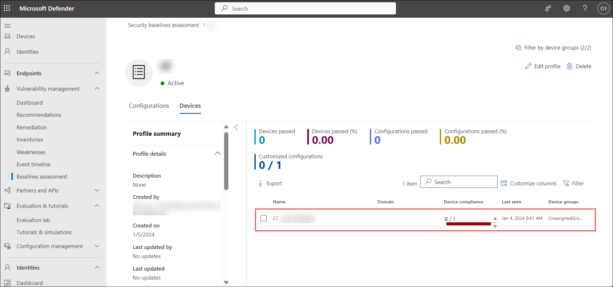

## Review

In this lab, you have completed the following:

- Overview of Vulnerability Management dashboard
- Explored Security recommendations
- Explored Security baselines assessment

## You have successfully completed the lab. Click on Next >>.