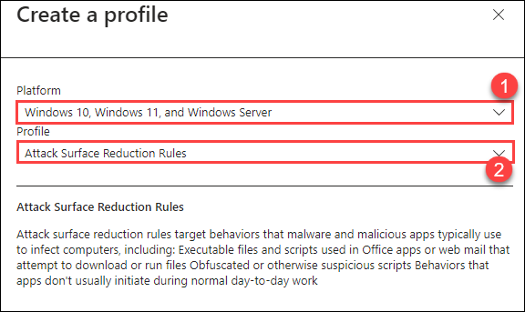

# Lab 05 - Configure & Test Defender for Endpoint capabilities

## Lab scenario

## Lab objectives (Duration: 60 minutes)

## Architecture Diagram

### Task 1: Create Attack Surface Reduction Rules 

1. Open the [Microsoft Intune admin center](https://go.microsoft.com/fwlink/?linkid=2109431).

1. From the left-navigation menu select, **Endpoint Security**. On the **Endpoint security | Overview** page, from the left-navigation menu select **Attack surface reduction**.

1. Select **+ Create Policy**.

1. On **Create a profile** page, under **Platform** select **Windows 10, Windows 11, and Windows Server (1)**, and in **Profile**, select **Attack surface reduction rules (2)**.

    

1. Select **Create**.

1. In the Basics tab of the **Create profile** pane, in **Name** add a name for your policy. In **Description** add a description for your ASR rules policy.

1. In the **Configuration settings** tab, under **Attack Surface Reduction Rules**, follow these instructions, and select **Next**:

    |Settings|Value|
    |--------|-----|
    |Block Adobe Reader from creating child processes|Audit|
    |Block execution of potentially obfuscated scripts|Audit|
    |Block Win32 API calls from Office macros|Audit|
    |Block credential stealing from the Windows local security authority subsystem|Audit|
    |Block executable files from running unless they meet a prevalence, age, or trusted list criterion|Audit|
    |Block JavaScript or VBScript from launching downloaded executable content|Audit|
    |Block Office communication application from creating child processes|Audit|
    |Block all Office applications from creating child processes|Audit|
    |Block Webshell creation for Servers|Audit|
    |Block untrusted and unsigned processes that run from USB|Audit|
    |Block process creations originating from PSExec and WMI commands|Audit|
    |Block persistence through WMI event subscription|Audit|
    |Block Office applications from creating executable content|Audit|
    |Block Office applications from injecting code into other processes|Audit|
    |Use advanced protection against ransomware|Audit|
    |Block executable content from email client and webmail|Audit|
    |Block abuse of exploited vulnerable signed drivers (Device)|Audit|
    |Enable Controlled Folder Access|Audit Mode|

1. In the **Scope tags** pane, keep everything as default and select **Next**.

    >**Note:** you can add tag information to specific devices. You can also use role-based access control and scope tags to make sure that the right admins have the right access and visibility to the right Intune objects. Learn more: Use role-based access control (RBAC) and scope tags for distributed IT in Intune.

1. In the **Assignments** pane, you can deploy or "assign" the profile to your user or device groups. Under **Included groups** select **Add groups** and selct the **Sg-IT** group that you created in Lab-01, select **Next**.

1. Now, review your settings in the **Review + create** pane. Click **Create** to apply the rules.

1. Your new attack surface reduction policy for ASR rules is listed in **Endpoint security | Attack surface reduction**.

    

