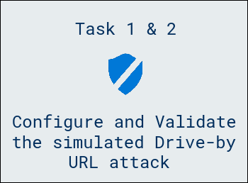
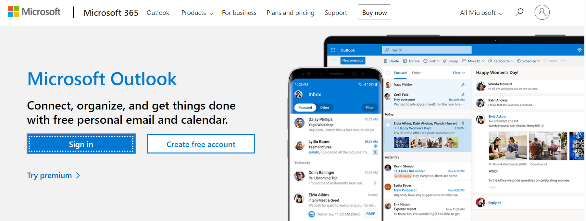

# Lab 06 - Simulate & Investigate Attacks

## Lab scenario

In this lab, participants configured and executed a simulated Drive-by URL attack, a common cybersecurity threat. By setting up the attack parameters and launching it, participants gained practical insights into the techniques employed by attackers in spreading malware through malicious websites. Additionally, participants validated the success of the simulated Drive-by URL attack, allowing for a comprehensive understanding of the potential risks and the importance of robust cybersecurity measures to counter such threats.

## Lab objectives

In this lab, you will perform the following:

- Task 1: Configure and launch a Drive-by URL attack  
- Task 2: Validate the simulated Drive-by URL attack

## Architecture Diagram

  

### Task 1: Configure and launch a Drive-by URL attack 

1. If you are not already at the Microsoft Defender portal in your browser, start the Microsoft Edge browser go to (https://security.microsoft.com) and log in with the **Tenant Email** credentials.

1. In the **Microsoft Defender** portal, from the left-hand navigation pane, under the **Email & collaboration** section, select **Attack simulation training**.

1. On the **Attack Simulation training** page, the **Overview** tab is displayed by default. Select the **Simulations** tab, and then select the **+ Launch a simulation** option that appears on the menu bar. This initiates the **Simulation** wizard.

1. On the **Select Technique** page in the **Simulation** wizard, scroll down and select the **Drive-by URL (1)** option. Under this option, select the **View details of Drive-by URL** link. This opens a **Drive-by URL** pane on the right. Review the **Description** and the **Simulation steps** for this type of attack. When you're done, close the **Drive-by URL** pane and select **Next (2)**.

	.png)

1. On the **Name Simulation** page, enter **Custom payload** in the **Simulation name** field and then select **Next**.

1. On the **Select payload and login page**, the **Global payloads** tab is displayed by default. Select the **Tenant payloads** tab, and then select **+ Create a payload** on the menu bar. This initiates the **Payload** wizard.

1. On the **Select type** page of the **Payload** wizard, the **Email** option should be selected by default (if not, select it now). Select **Next**. 

1. On the **Select Technique** page, the **Drive-by URL** attack type should be selected by default (all other options are disabled since you already selected this option back in step 5). Select **Next**.

1. On the **Payload Name** page, enter the following information:

	- Payload name: **Free gift offer**
	- Description: **This payload is for Drive-by URL threats offering free prizes and gifts that are too good to be true**

1. Select **Next**.

1. On the **Configure Payload** page, enter the following information:

	- From name: **ODL_User <inject key="DeploymentID" enableCopy="false"/>**
	- From email: **<inject key="AzureAdUserEmail"></inject>**
	- Email subject: **Free toy giveaway promotion from Tailspin Toys**
	- Select a URL you want to be your phishing link: select the **Select URL** button, which opens a pane of predefined phishing link URLs; select **https://www.prizegives.com** from the list of fictitious URLs (to quickly find this URL, enter **prizegives** in the Search box). and then select **Confirm** 
	- Theme: **Personalized Offer**
	- Industry: **Retail**
	- Current Event: **Yes**
	- Select the language for payload : **English** 
	- Email message: Under the Text tab in this **Email message** section, enter the following text in the message box; this message will be displayed in the body of the email message: **Tailspin Toys is offering you a FREE, one-time only giveaway of a toy of your choice as part of our 25th anniversary celebration! Please click on the following link to select the toy of your choice:** 
	- After entering the prior message, select the **Phishing link** button that appears just above the message box (to the right of **Dynamic tag**). In the **Name Phishing Url** dialog box that appears, enter **Free25thAnniversaryGift@tailspintoys.com** in the **Name** field and then select **Confirm**.

	The message should now appear as: 

	Tailspin Toys is offering you a FREE, one-time only gift of the toy of your choice as part of our 25th anniversary celebration! Please click on the following link to select the toy of your choice: **Free25thAnniversaryGift@tailspintoys.com** (make sure you have a space between the colon and the start of the link to make it look nice)

1. Select **Next**.	

1. On the **Add Indicators** page, select **Add Indicator**.

1. On the **Add Indicator** pane that appears on the right, enter the following information:

	- Select an indicator you would like to use: **Too good to be true offers**
	- Where do you want to place this indicator on payload: **From the Body of the Email**

1. A **Select Text** button will appear. Select this button.

1. In the **Select the required text** pane that appears on the right, drag your cursor from the start of the code block to the end, so that the entire code block is highlighted. This will enable the **Select** button. Select this button. This returns you to the **Add indicator** pane. 

1.  In the **Indicator Description** field, replace the default description with the following text: **Free gifts or other one-time only promotional giveaways**.

1. Select inside the **Indicator Preview** area to see a preview of the indicator message. Then select outside the **Indicator Preview** field to exit the preview. 

1. Select the **Add** button at the bottom of the **Add Indicator** pane.

1. On the **Add Indicators** page, the indicator that you just created should be displayed. Select **Next**.

1. On the **Review Payload** page, review the entered information. If anything needs to be changed, select the appropriate **Edit** option to make the change, or select **Back** to enter any of the information in the Configure section. Once everything is correct, select **Submit**. After a few moments you will receive a confirmation stating **New payload created**. Select **Done**. 

1. On the **Select payload and login page** window, the **Free gift offer** payload that you just created should appear in the list. Select the check box to the left of the **Free gift offer** payload, and then select **Next**. 

1. On the **Target Users** page, verify the **Include only specific users and groups** option is selected (if not, select it now), and then select **+ Add Users**. 

1. In the **Add Users** pane that appears, in the **Search for Users or Groups** field at the top of the pane, enter **ODL_User <inject key="DeploymentID" enableCopy="false"/>** and then hit Enter. In the list of users that appears whose name starts with Lynne, select **ODL_User <inject key="DeploymentID" enableCopy="false"/>** and then select **Add 1 User(s)**.

1. On the **Target Users** page, Lynne Robbins should be displayed as the targeted user. Select **Next** and then select **Next** again on the **Exclude users** page. 

1. On the **Assign Training** page, under the **Preferences** section, the **Assign training for me (Recommended)** option should be selected by default (if not, select it now). Select the **Due Date** field. In the drop-down menu that appears, select **7 days after Simulation ends** and then select **Next**.

1. On the **Select Phish landing page** window, the **Global landing pages** tab should be displayed by default. Select the **Microsoft Landing Page Template 1** name to preview the page. 

1. A preview of the **Microsoft Landing Page Template 1** appears in the pane on the right. This preview panel provides an example of what the landing page will look like when someone experiences a Drive-by URL attack and the simulation uses **Microsoft Landing Page Template 1**. Scroll down through this preview panel and review the features of this template. When you're finished, select the **Close** button at the bottom of the preview panel. 

1. You will now look at some of the other landing page templates until you find one that you want to use for this simulation. On the **Select Phish landing page** window, select one of the other templates (select the name of the template and not its checkbox). Examine the preview panel and note how the landing page for this template is different from **Microsoft Landing Page Template 1**. When you're finished, select the **Close** button at the bottom of the preview panel.

1. Repeat the prior step and select another template. Note how this template is different from the other two you looked at.

	- Repeat this step as many times as you would like until you find a template that you want to use for this simulation. Once you're satisfied with a template, select the checkbox for that template on the **Select Phish landing page** and then select **Next**.

1. On the **Select end user notification** page, choose how you want the end user to be notified. For the purpose of this lab, select **Microsoft default notification (recommended)**. In the list of notifications that appears, configure the following notifications:

	 - Microsoft default positive reinforcement notification - set **Delivery preferences** to **Deliver after simulation ends**
	 - Microsoft default training reminder notification - set **Delivery preferences** to  **Weekly**

1. Select **Next**.

1. On the **Launch Details** page, select the **Launch this simulation as soon as I'm done** option and then select **Next**.

1. On the **Review Simulation** page, review the entered information. If anything needs to be changed, select the appropriate **Edit** option to make the change. Once everything is correct, select **Submit**. It may take a few minutes before you receive a confirmation stating **Simulation has been scheduled for launch**. Select **Done**.   

	>**Note:** Once the simulated drive-by URL attack is launched, an email should be sent to Lynne Robbins. It can take up to 15 minutes for the email to be generated. Rather than waiting for the email to be generated, you will validate the email and review the diagnostic results of the attack in Exercise 7, task 5 of this lab.

1. Leave your Edge browser and all tabs open and proceed to the next exercise.

### Task 2: Validate the simulated Drive-by URL attack

1. Open an another tab, and browse to the [Outlook](https://www.microsoft.com/en/microsoft-365/outlook/email-and-calendar-software-microsoft-outlook?deeplink=%2Fowa%2F&sdf=0), select **Sign in**. If it asks you for the sign-in credentials, then enter these credentials, 

	- Username: <inject key="AzureAdUserEmail"></inject>
	
	- Password: <inject key="AzureAdUserPassword"></inject>

		

1. In Outlook Inbox, you should see the email that was sent by the Attack Simulator. The subject of the email is **Free toy giveaway promotion from Tailspin Toys**. Do not open the email, since like the previous alert emails, the link inserted in the email doesn't appear to work when you open the email. Instead, simply select the email to view it in the Outlook preview pane. 

1. In the email, you should recognize the message that appears. The purpose of this message is to trick the user into thinking this is a legitimate email, when in fact, it's a Drive-by URL attack. 

1. To test this simulated attack, select the **Free25thAnniversaryGift@tailspintoys.com** link. Note what happens - the simulated drive-by URL attack displays a web page that indicates you were just phished by your IT team. It instructs you that legitimate sounding sites such as **https://www.prizegives.com**, which was the site linked to the **Free25thAnniversaryGift@tailspintoys.com** link, have been compromised by malicious attackers. So even though you may see the underlying www.prizegives.com site and you think it's legitimate, it's in fact been compromised. This site also shows you a list of information that could have been captured had this been a real attack. 

1. In your Edge browser, select the tab containing Outlook mailbox. Note the additional email that arrived in Inbox from the **Security and Compliance Team**. This is a legitimate email that was sent. When you configured the simulated spear phishing attack, one of the options you selected was to send a weekly Microsoft default training reminder notification.

1. Close, the Outlook tab.

## Review
In this lab, you have completed the following:

- Configured and launch a Drive-by URL attack 
- Validated the simulated Drive-by URL attack

## You have successfully completed the lab.
 
