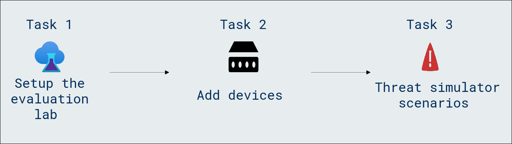
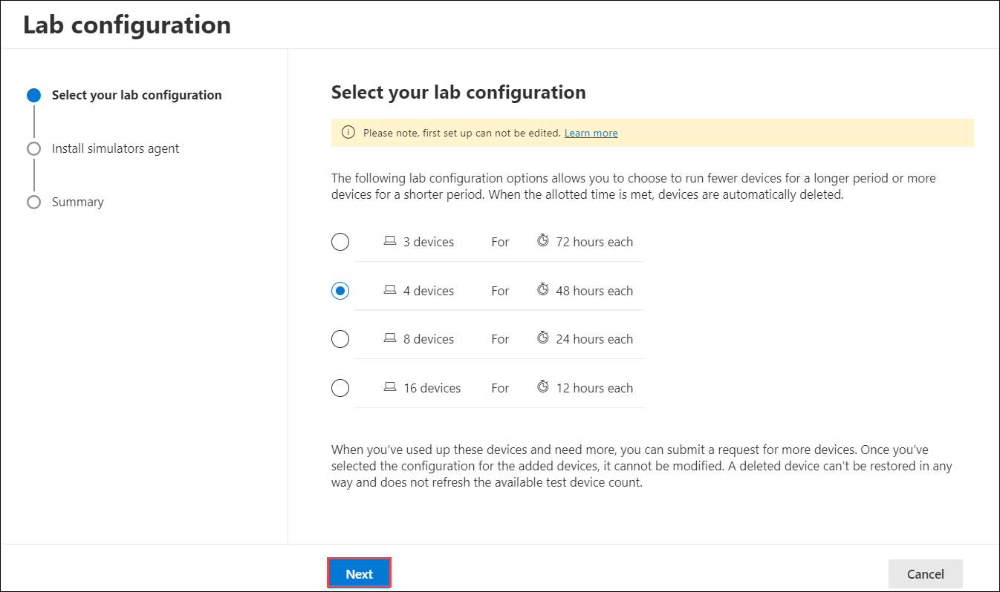
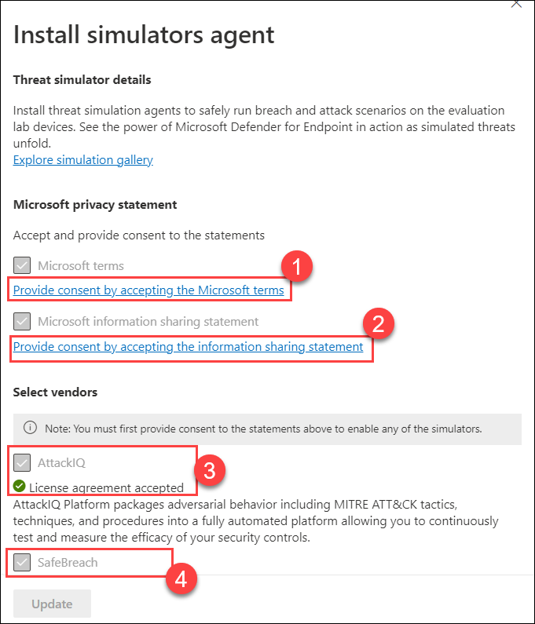
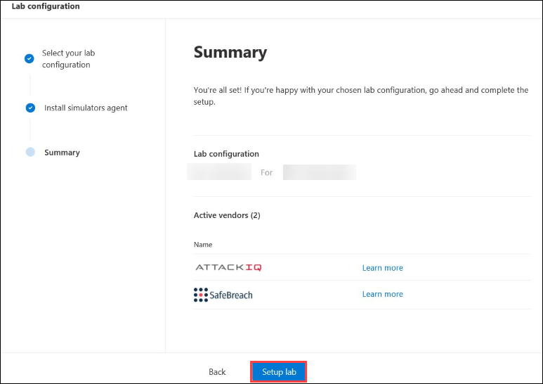
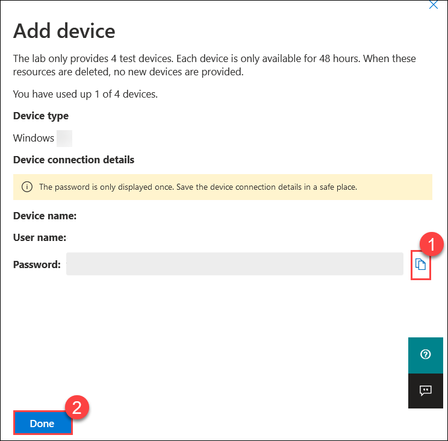
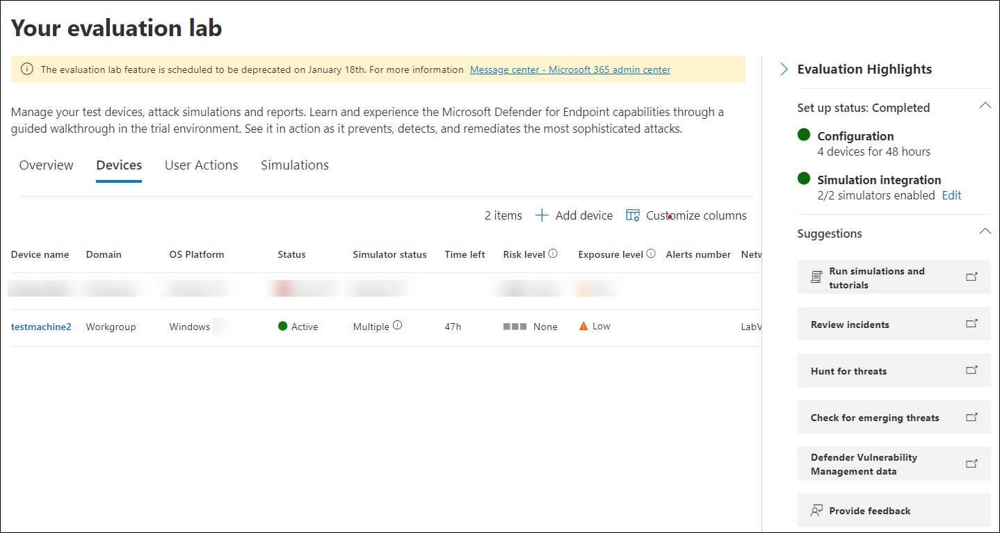
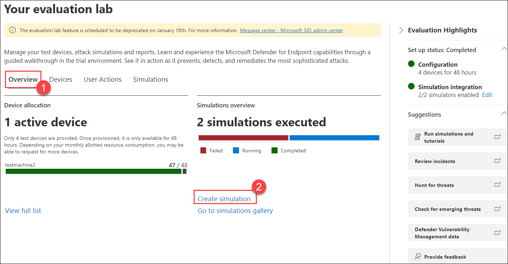
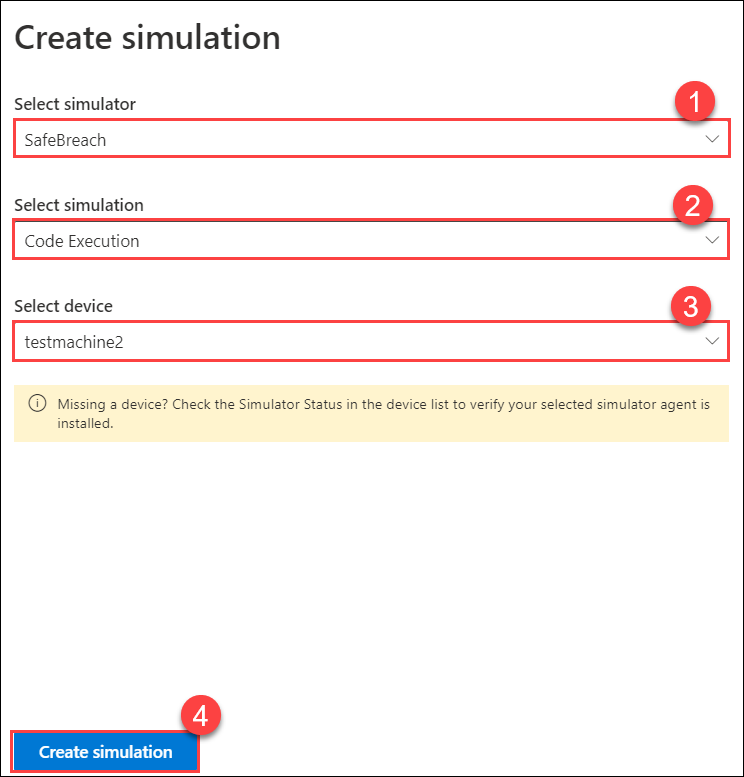
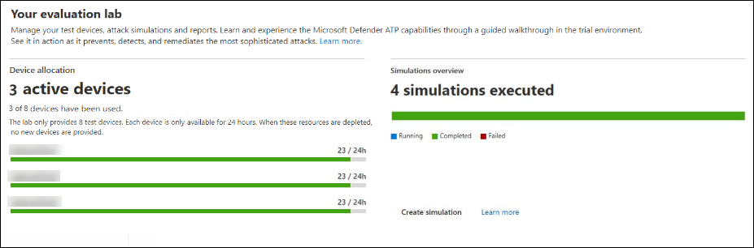

# Lab 07 - Setup an evaluation Lab

## Lab overview

The lab encompasses the setup of an evaluation lab, the addition of devices to the lab environment, and the execution of Threat Simulator scenarios. Participants will actively engage in building and assessing a controlled environment to simulate and respond to potential cybersecurity threats.

## Lab scenario

The objective of this lab is to provide a hands-on experience in setting up an evaluation environment. This involves configuring the lab, adding devices, and implementing various threat simulator scenarios.

- **Setup the Evaluation Lab**: Participants will learn the process of setting up an evaluation lab environment for simulating cybersecurity scenarios.
Understanding the importance of controlled environments for testing and evaluation is a key objective.

- **Add Devices**: The lab guides participants in adding devices to the evaluation lab environment.
Participants will understand the steps involved in expanding the lab to include diverse devices.

- **Threat Simulator Scenarios**: Participants will actively execute Threat Simulator scenarios within the lab.

## Lab objectives

In this lab, you will perform the following:

- Task 1: Setup the evaluation lab
- Task 2: Add devices
- Task 3: Threat simulator scenarios

## Architecture Diagram

### Task 1: Setup the evaluation lab

1. If you are not already at the Microsoft 365 Defender portal in your Microsoft Edge browser, go to (https://security.microsoft.com). 

1. In the **Sign in** dialog box, copy and paste * Email/Username: <inject key="AzureAdUserEmail"></inject> and then select Next.

1. In the **Enter password** dialog box, copy and paste * Password: <inject key="AzureAdUserPassword"></inject> and then select **Sign in**.

1. From the left navigation menu, under **Endpoints**, select **Evaluation & tutorials**, then select **Evaluation lab**.

1. Select the **Setup lab**.

1. Depending on your evaluation needs, you can choose to setup an environment with fewer devices for a longer period or more devices for a shorter period. Select your preferred lab configuration then select **Next**.

    

1. On the **Install simulators agent** tab, under the **Microsoft privacy statement**, select **Provide consent by accepting the Microsoft terms (1)**. This action will display the **Microsoft terms** page; here, you should select **I accept**. Now, return to the **Install simulators agent** tab, and select **Provide consent by accepting the information sharing statement (2)**. On the **Microsoft information sharing statement** page, again select **I accept**.

1. Under **Select vendors**, accept the license agreement of **AttackIQ (3)** by selecting the links which is written under the AttackID, select the checkbox of **AttackIQ**, and select the checkbox of **SafeBreach (4)**, fill these credentials, after filling the credentials select **Next**.

    - Email address: <inject key="AzureAdUserEmail"></inject>
    - First name: odl
    - Last name: user <inject key="DeploymentID" enableCopy="false"/></inject>

        

1. Review the summary and select **Setup lab**.  

    >**Note:** you can select the threat simulation agent you'd like to use and enter your details. You can also choose to install threat simulators at a later time. If you choose to install threat simulation agents during the lab setup, you'll enjoy the benefit of having them conveniently installed on the devices you add.

    

### Task 2: Add devices

1. On the **Your evaluation lab** page, select **Devices** tab.

1. On the **Devices** page, click **+ Add device**, choose **Windows 10** from the **Device type** drop-down, select your preferred tools from **Available Tools**, and then click **Add device**.

    >**Note:** You can choose to add Windows 10, Windows 11, Windows Server 2019, Windows Server 2016, and Linux (Ubuntu).

    >**Note:** If something goes wrong with the device creation process, you'll be notified and you'll need to submit a new request. If the device creation fails, it will not be counted against the overall allowed quota.

1. The connection details are displayed. Select **Copy (1)** to save the password for the device, and select **Done (2)**.

    >**Note:** The password is only displayed once. Be sure to save it for later use.

    

1. Device setup begins. This may take more than 2-3 hours. 

    >**Note:** You can move on to the next tasks; you can come back after 2-3 hours and check.

1. See the status of test devices, the risk and exposure levels, and the status of simulator installations by selecting the Devices tab.

    

### Task 3: Threat simulator scenarios

1. On the **Overview (1)** page of **Your evaluation lab**, select **Create simulation (2)**.

    

1. On the **Create simulation** page, choose **Select simulator (1)**, choose **Select simulation (2)**, and now choose **Select device (3)**. Once, done select **Create simulation (4)**.

    

1. Navigate back to the **Evaluation lab** tab to check the status of your simulation under **Simulation overview**—whether it's completed, running, or failed.

    

## Review
In this lab, you have completed the following:

- Setup the evaluation lab
- Added devices
- Threat simulator scenarios

## You have successfully completed the lab.
